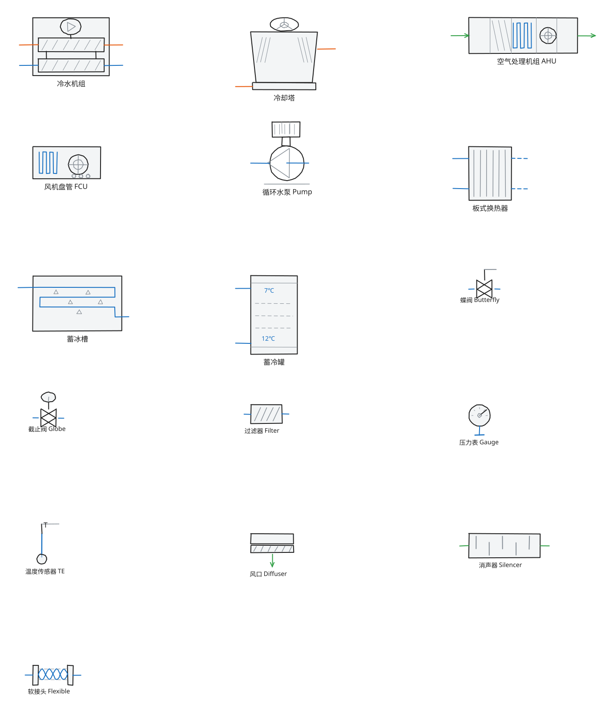

# hvac-excalidraw-library

> 一套**手绘风格**的中央空调 / HVAC 暖通 Excalidraw 素材库。
> 全部元件都是 Excalidraw **原生矢量图形**（不是图片、不是 SVG 贴图），导出为 `.excalidrawlib`，兼容网页版 Excalidraw 与 Obsidian Excalidraw 插件。


<p>
  
  
  
  
</p>

---

## 一、这是什么

做暖通 / 机电方案、机房原理图、空调水系统图时，最烦的是每次都从零画那几个方块：冷机、水泵、AHU、阀件……
这个库把这批**高频重复元件**一次性画好，拖出来就能用，还能随手改颜色、改尺寸、改标签。

**特点**

| 特点 | 说明 |
| --- | --- |
| 纯原生矢量 | 每个元件都是 Excalidraw 的 rectangle / ellipse / line / text，可任意缩放、改色、解组 |
| 手绘风格 | 统一 `roughness = 1`（手绘）+ 手写体，风格一致，不会一张图里"生图混木块" |
| 已分组 | 每个元件插入画布后是一个整体，拖动不会散架（`Ctrl/Cmd + Shift + G` 可解组） |
| 中英双版 | 中文主库自用；英文库用于投稿 Excalidraw 官方库 |
| 可复现 | `tools/build_library.py` 用代码生成全部元件，改线型/改配色一把梭，不用手绘重画 |
| 零依赖 | 没有前端、没有后端、没有 npm install，克隆下来就是素材 + 文档 |

## 二、这不是什么

- ❌ 不是一个软件项目：**没有代码需要编译运行**，核心资产就是 `library/` 里的 `.excalidrawlib` 文件
- ❌ 不需要安装插件才能用（Obsidian 用户除外，那本来就要装 Excalidraw 插件）
- ❌ 不是 CAD 制图库，不追求施工图精度，**定位是方案沟通 / 原理示意 / 汇报配图**

## 三、元件清单（v1.0.0 共 16 个）

### 3.1 冷热源主机

| # | 元件 | 英文名 | 主要构成 | 典型用途 |
| --- | --- | --- | --- | --- |
| 1 | 冷水机组 | Chiller | 双筒式：上冷凝器 + 下蒸发器 + 顶置压缩机（内置叶轮）+ 四路接管 | 冷冻站原理图、主机房平面 |
| 2 | 冷却塔 | Cooling Tower | 收口塔体 + 顶部风机 + 两侧进风格栅 + 底部集水盘 | 冷却水系统、屋面上塔布置 |
| 3 | 空气处理机组 AHU | Air Handling Unit (AHU) | 混风段 / 过滤段 / 表冷段 / 风机段 / 送风段 | 空调箱接管示意、风系统图 |
| 4 | 风机盘管 FCU | Fan Coil Unit (FCU) | 盘管 + 离心风机 + 三档调速标识 | 末端布置、水系统末端 |

### 3.2 水力与蓄能设备

| # | 元件 | 英文名 | 主要构成 | 典型用途 |
| --- | --- | --- | --- | --- |
| 5 | 循环水泵 | Circulation Pump | 电机 + 联轴器 + 泵壳 + 叶轮 + 进出口 + 底座 | 冷冻/冷却水循环、水泵房 |
| 6 | 板式换热器 | Plate Heat Exchanger | 板片束 + 两侧四路接管（实线一次侧 / 虚线二次侧） | 冰蓄冷换热、换热站 |
| 7 | 蓄冰槽 | Ice Storage Tank | 槽体 + 乙二醇蛇形盘管 + 冰晶示意 | 冰蓄冷制冰/融冰工况 |
| 8 | 蓄冷罐 | Chilled Water Tank | 立式罐体 + 斜温层 + 供回水接管 + 7℃/12℃ 分层标注 | 水蓄冷、缓冲罐 |

### 3.3 阀件与仪表

| # | 元件 | 英文名 | 主要构成 | 典型用途 |
| --- | --- | --- | --- | --- |
| 9 | 蝶阀 | Butterfly Valve | 阀体（蝴蝶形）+ 阀杆 + 手柄 | 水管路切断、支路控制 |
| 10 | 截止阀 | Globe Valve | 阀体 + 阀杆 + 手轮 | 仪表前切断、小口径管路 |
| 11 | 过滤器 | Strainer / Filter | 滤网框 + 斜纹滤芯 + 两侧接管 | 冷机/水泵入口保护 |
| 12 | 压力表 | Pressure Gauge | 表盘 + 指针 + 刻度 + 接管 | 供回水压力监测点 |
| 13 | 温度传感器 | Temperature Sensor | 套管 + 感温包 + 接线 + `T` 标识 | 供回水温度测点 |

### 3.4 风系统

| # | 元件 | 英文名 | 主要构成 | 典型用途 |
| --- | --- | --- | --- | --- |
| 14 | 风管风口 | Duct Outlet / Diffuser | 风管 + 百叶 + 气流箭头 | 送/回风口布置 |
| 15 | 消声器 | Duct Silencer | 外壳 + 交错隔板消声片 | 风管系统降噪段 |
| 16 | 软接头 | Flexible Connector | 两侧法兰 + 双波浪可挠管壁 | 水泵/冷机进出口减振 |

> 配色约定：描边近黑 `#1e1e1e` · 冷却水/热水橙 `#e8590c` · 冷冻水/冷媒蓝 `#1971c2` · 风管绿 `#2f9e44` · 辅助线灰 `#868e96`。
>
> 后续计划（欢迎提 Issue 排队）：膨胀水箱、分集水器、电动调节阀、温控器、散流板、多联机室外机。
> 需求请用 [新元件需求 Issue 模板](.github/ISSUE_TEMPLATE/new_component.md)。

<p align="center">
  
</p>

## 四、快速开始

### 方式 A：下载文件（推荐）

1. 到 [Releases](https://github.com/hon668/hvac-excalidraw-library/releases) 页面下载最新版
   `hvac-excalidraw-library-zh-v1.0.0.excalidrawlib`
2. 按下面第五节的教程导入即可

### 方式 B：克隆仓库

```bash
git clone https://github.com/hon668/hvac-excalidraw-library.git
# 素材库文件在 library/ 目录
```

### 方式 C：只想要源码构建（改配色 / 加元件）

```bash
cd hvac-excalidraw-library
python tools/build_library.py      # 生成 library/ examples/ docs/assets/
```

无需安装任何第三方依赖，只要有 Python 3.9+ 即可。

## 五、导入使用教程

### 5.1 网页版 Excalidraw（excalidraw.com）

1. 浏览器打开 <https://excalidraw.com>
2. 左侧竖排工具栏点击**「库 / Library」**图标（书本形状），或直接按快捷键 <kbd>9</kbd> 打开库面板
3. 在库面板里点 **「浏览库 / Browse libraries」** → 弹窗右下角选 **「打开 / Open」**
4. 选中下载好的 `hvac-excalidraw-library-zh-v1.0.0.excalidrawlib` 文件
5. 面板里出现 16 个元件缩略图 → **鼠标直接拖到画布**即可

> ⚠️ 注意：网页版把自定义库存在**浏览器本地存储**里。换电脑、换浏览器、清理浏览器缓存都会丢。
> 长期使用建议把 `.excalidrawlib` 文件存在云盘/仓库里，需要时重新 `Open` 一次（几秒钟的事）。

> 💡 提示：库面板顶部有 **「导出 / Export」**，可以把你改过的库再导出成新文件，方便自己维护私藏版本。

### 5.2 Obsidian + Excalidraw 插件

前置条件：Obsidian 已安装社区插件 **Excalidraw**（作者 zsviczian）。

1. 把 `.excalidrawlib` 文件放进你的 Obsidian 库（Vault）任意位置，例如
   `你的Vault/附件/Excalidraw库/hvac-excalidraw-library-zh-v1.0.0.excalidrawlib`
2. 新建或打开一张 Excalidraw 图（命令面板 → `Excalidraw: Create new drawing`）
3. 打开 Excalidraw 库面板：
   - 左侧 Excalidraw 工具栏点**书本 / Library 图标**；
   - 或命令面板执行 `Excalidraw: Open Library`
4. 库面板顶部点 **「Load library」**（装载库），在文件选择器里选中第 1 步的 `.excalidrawlib` 文件
5. 元件出现在库面板 → **拖到画布**使用；之后该元件会长期留在你的库面板里

> 💡 Obsidian 用户的额外好处：`.excalidrawlib` 文件本身放在 Vault 里，可以和笔记一起被 Git / 同步盘管理，
> 队员之间直接共享这一个文件就等于共享整套元件库。

### 5.3 插入后的编辑技巧

| 想做的事 | 操作 |
| --- | --- |
| 改颜色 | 选中元件 → 左侧属性面板改「描边色 / 背景色」（会作用于组内元素） |
| 拆开元件逐个改 | <kbd>Ctrl/Cmd</kbd> + <kbd>Shift</kbd> + <kbd>G</kbd> 解除分组 |
| 删除元件自带的文字标签 | 解组后选中文字按 <kbd>Delete</kbd>，然后换自己的标签 |
| 整体缩放 | 选中元件拖动角点，或属性面板直接改宽高 |
| 复制一份 | <kbd>Ctrl/Cmd</kbd> + <kbd>D</kbd> |
| 让线更"手工 / 更规整" | 属性面板「粗糙度」：手绘 ↔ 建筑师 ↔ 卡通 |

## 六、示例图说明

仓库 `examples/` 目录下都是**用本库元件拼出来的完整示例**，下载后用 Excalidraw 打开即可直接改。

| 文件 | 内容 | 用到的元件 |
| --- | --- | --- |
| `01-chilled-water-system.excalidraw` | 冷冻水系统原理图：冷机 → 蝶阀 → 过滤器 → 一次泵/二次泵 → 软接头 → 末端（AHU + FCU），含压力表、温度测点与供回水标注 | 冷机、水泵、AHU、FCU、蝶阀、过滤器、压力表、温度传感器、软接头 |
| `02-ahu-duct-layout.excalidraw` | 空调箱风路接管示意：新风/回风 → AHU → 软接头 → 消声器 → 送风干管 → 支管风口 | AHU、软接头、消声器、风管风口 |
| `03-ice-storage-system.excalidraw` | 冰蓄冷系统原理图：**冷却水 / 乙二醇 / 冷冻水三个环路**同图，含冷却塔回路上塔、蓄冰槽制冰、板换换热与蓄冷罐分层 | 冷却塔、冷机、水泵 ×2、蝶阀、压力表、蓄冰槽、板换、蓄冷罐、温度传感器、软接头 |

<p align="center">
  
</p>

<p align="center">
  
</p>

> `03` 号图是最能体现本库能力的一张：三种环路用**颜色 + 线型**区分（橙实线=冷却水、蓝实线=乙二醇、蓝虚线=冷冻水），
> 每条管线的端点都精确落在元件接管端头上，可以直接照着改。

**打开示例的方法**：网页版 Excalidraw 直接拖 `.excalidraw` 文件进画布；Obsidian 里把文件放进 Vault 后双击打开。
示例仅作**画法示范**，实际工程请按项目图纸调整。

## 七、仓库结构

```
hvac-excalidraw-library/
├── README.md                              # 你正在看的文件
├── LICENSE                                # MIT 开源协议
├── CONTRIBUTING.md                        # 贡献指南（怎么加元件、怎么提 PR）
├── VERSIONING.md                          # 版本号规则 + Release 发布步骤
├── CHANGELOG.md                           # 更新日志
├── .gitignore
├── .gitattributes                         # 统一换行符，避免 JSON 文件出现整文件 diff
├── .github/
│   ├── ISSUE_TEMPLATE/
│   │   ├── new_component.md               # 新元件需求模板
│   │   ├── bug_report.md                  # 问题反馈模板
│   │   └── config.yml
│   └── PULL_REQUEST_TEMPLATE.md
├── library/
│   ├── hvac-excalidraw-library-zh-v1.0.0.excalidrawlib   # 中文标签（主库，日常用）
│   ├── hvac-excalidraw-library-en-v1.0.0.excalidrawlib   # 英文标签（投稿官方库用）
│   └── README.md
├── examples/
│   ├── 01-chilled-water-system.excalidraw
│   ├── 02-ahu-duct-layout.excalidraw
│   ├── 03-ice-storage-system.excalidraw
│   └── README.md
├── docs/                                  # GitHub Pages 站点（设置里选 /docs 目录）
│   ├── index.md
│   ├── _config.yml
│   ├── setup-github-repo.md               # 从零发布到 GitHub 的分步操作清单
│   ├── pr-to-official-library.md          # 投稿官方库的 PR 文案
│   └── assets/
│       ├── preview-components.svg/.png
│       ├── preview-components-en.svg/.png
│       ├── preview-example-system.svg
│       ├── preview-example-duct.svg
│       └── preview-example-ice.svg
├── tools/
│   ├── build_library.py                   # 素材库构建脚本（生成上面所有产物）
│   ├── setup_repo.py                      # 上传 GitHub 前替换占位符 + 重命名投稿目录
│   └── README.md
└── submission/
    └── hon668/              # 提 PR 到官方库时直接把该目录内容上传
        ├── hvac-handdrawn-components.excalidrawlib
        └── hvac-handdrawn-components.png
```

## 八、自己加元件 / 改配色

所有元件都由 `tools/build_library.py` 生成，一条命令重出全部产物。核心改动点：

| 需求 | 改哪里 |
| --- | --- |
| 调整配色 | 文件顶部 `STROKE / BLUE / ORANGE / GREEN / GRAY / LIGHT` 常量 |
| 新增一个元件 | 写一个 `c_xxx(zh)` 函数 → 加进 `COMPONENTS` 列表 |
| 调整标签文案 | 在元件函数里改 `label(...)` 的字符串 |
| 版本号 | 文件顶部 `VERSION`（同时改名 `library/` 下的文件名） |

用 Excalidraw **手绘导出**的方式也能贡献元件，流程见 [CONTRIBUTING.md](CONTRIBUTING.md) 的「路线 B」。

## 九、版本与更新

版本号遵循[语义化版本](https://semver.org/lang/zh-CN/) `v主.次.修订`：

- **主版本**：元件被删除/重命名，或数据结构不再兼容旧文件
- **次版本**：新增元件（向后兼容）
- **修订号**：修正图形错误、调整描边、改文案

完整规则与 Release 发布步骤见 [VERSIONING.md](VERSIONING.md)，变更记录见 [CHANGELOG.md](CHANGELOG.md)。

## 十、贡献

欢迎补充元件、修正图形、提需求。请先读 [CONTRIBUTING.md](CONTRIBUTING.md)。

- 🐛 发现图形画错了 → [Bug Report](.github/ISSUE_TEMPLATE/bug_report.md)
- ✨ 想要一个库里没有的元件 → [新元件需求](.github/ISSUE_TEMPLATE/new_component.md)
- 🔧 已经画好了元件想合进来 → 直接提 PR（模板会自动加载）

## 十一、开源协议

本项目采用 [MIT License](LICENSE) —— 可以自由用于商用项目、可以修改、可以再分发，只需保留版权声明。
**换句话说**：你在公司方案里用这套元件画图、甚至把元件改成自己公司的样式，都不需要额外授权。

## 十二、免责声明

本库元件为**示意性图形**，不代表任何厂商设备的真实尺寸、接管位置或性能参数。
用于正式设计、招标、施工交底时，请以设备样本、设计图纸和规范要求为准。

---

如果这个库帮你省了一点画图时间，欢迎点个 ⭐ Star，也欢迎把缺的元件提上来 👉 [贡献指南](CONTRIBUTING.md)
