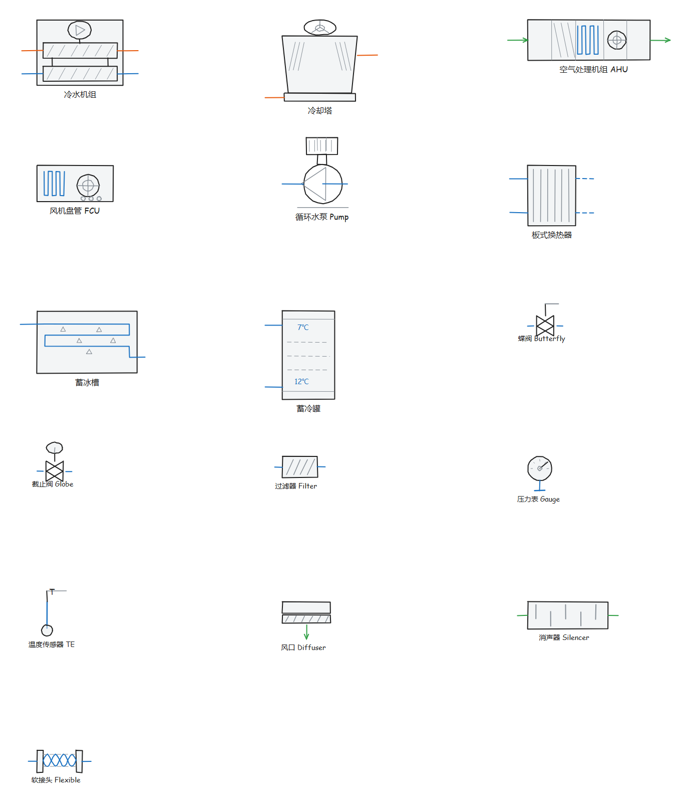
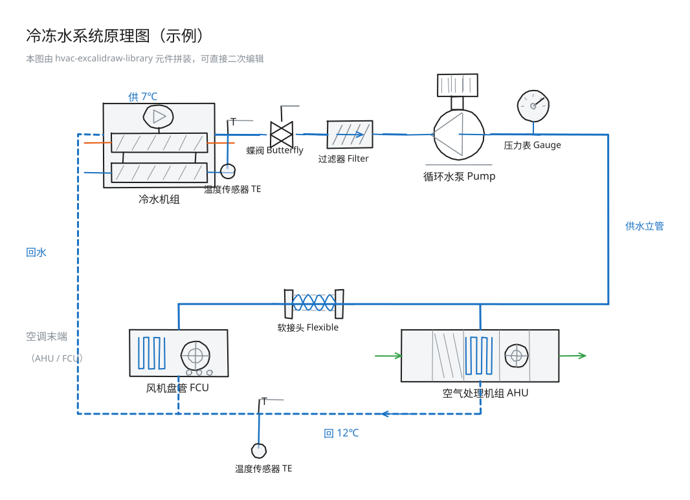
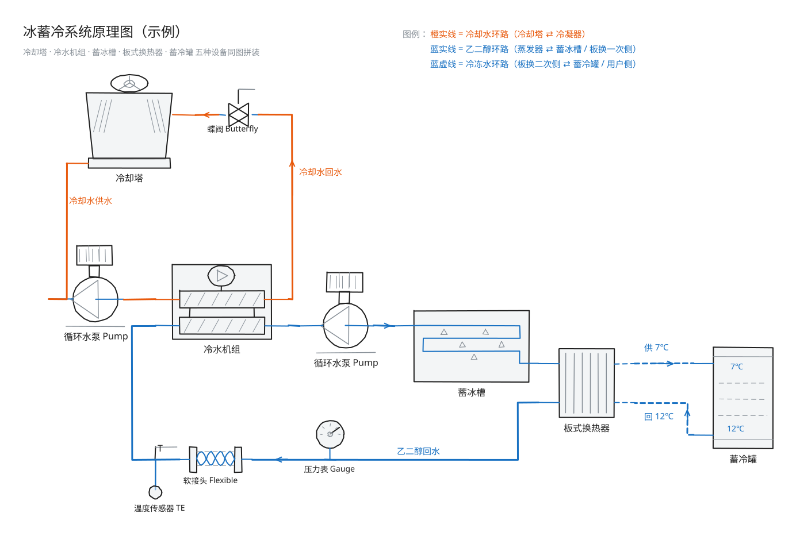

# HVAC Excalidraw 手绘素材库

**一套手绘风格的中央空调 / 暖通（HVAC）Excalidraw 元件库**
全部元件为 Excalidraw 原生矢量图形，兼容网页版 Excalidraw 与 Obsidian Excalidraw 插件。

<p>
  <a href="https://github.com/hon668/hvac-excalidraw-library">
    
  </a>
  <a href="https://github.com/hon668/hvac-excalidraw-library/releases">
    
  </a>
  
  
</p>

---

## 元件总览



---

## 包含哪些元件（16 个）

### 冷热源主机

| # | 元件 | 英文名 | 典型用途 |
| --- | --- | --- | --- |
| 1 | 冷水机组 | Chiller | 冷冻站原理图、主机房布置 |
| 2 | 冷却塔 | Cooling Tower | 冷却水系统、屋面上塔布置 |
| 3 | 空气处理机组 AHU | Air Handling Unit (AHU) | 空调箱接管、风系统图 |
| 4 | 风机盘管 FCU | Fan Coil Unit (FCU) | 末端布置、水系统末端 |

### 水力与蓄能设备

| # | 元件 | 英文名 | 典型用途 |
| --- | --- | --- | --- |
| 5 | 循环水泵 | Circulation Pump | 冷冻/冷却水循环 |
| 6 | 板式换热器 | Plate Heat Exchanger | 冰蓄冷换热、换热站 |
| 7 | 蓄冰槽 | Ice Storage Tank | 冰蓄冷制冰 / 融冰工况 |
| 8 | 蓄冷罐 | Chilled Water Tank | 水蓄冷、缓冲罐 |

### 阀件与仪表

| # | 元件 | 英文名 | 典型用途 |
| --- | --- | --- | --- |
| 9 | 蝶阀 | Butterfly Valve | 管路切断、支路控制 |
| 10 | 截止阀 | Globe Valve | 仪表前切断、小口径管路 |
| 11 | 过滤器 | Strainer / Filter | 冷机/水泵入口保护 |
| 12 | 压力表 | Pressure Gauge | 供回水压力监测 |
| 13 | 温度传感器 | Temperature Sensor | 供回水温度测点 |

### 风系统

| # | 元件 | 英文名 | 典型用途 |
| --- | --- | --- | --- |
| 14 | 风管风口 | Duct Outlet / Diffuser | 送/回风口布置 |
| 15 | 消声器 | Duct Silencer | 风管系统降噪 |
| 16 | 软接头 | Flexible Connector | 水泵/冷机进出口减振 |

> 配色：冷却水/热水 **橙** · 冷冻水/冷媒 **蓝** · 风管 **绿** · 辅助线 灰，统一手绘粗糙度。

---

## 30 秒上手

### 网页版 Excalidraw

1. 打开 <https://excalidraw.com>
2. 按 <kbd>9</kbd> 打开左侧**库 / Library**面板
3. **Browse libraries** → **Open** → 选中 `.excalidrawlib` 文件
4. 把元件拖到画布 ✅

### Obsidian Excalidraw 插件

1. 把 `.excalidrawlib` 文件放进你的 Vault
2. 打开一张 Excalidraw 图 → 打开库面板（命令面板 `Excalidraw: Open Library`）
3. 点 **Load library** → 选中该文件
4. 拖到画布 ✅

> 详细步骤（含快捷键、常见坑、插入后的编辑技巧）见仓库 README 的「导入使用教程」。

---

## 示例图纸

| 文件 | 内容 |
| --- | --- |
| `01-chilled-water-system.excalidraw` | 冷冻水系统原理图：冷机 → 蝶阀 → 过滤器 → 一次/二次泵 → 软接头 → AHU / FCU |
| `02-ahu-duct-layout.excalidraw` | 空调箱风路接管示意：新风/回风 → AHU → 软接头 → 消声器 → 风口 |
| `03-ice-storage-system.excalidraw` | 冰蓄冷系统原理图：冷却水（橙实线）/ 乙二醇（蓝实线）/ 冷冻水（蓝虚线）三环路，含冷却塔、蓄冰槽、板换、蓄冷罐 |

<p align="center">
  
</p>

<p align="center">
  
</p>

---

## 下载

**下载直链**（点开即下载，可直接发群里）：

```
https://github.com/hon668/hvac-excalidraw-library/releases/latest/download/hvac-excalidraw-library-zh-v1.0.0.excalidrawlib
https://github.com/hon668/hvac-excalidraw-library/releases/latest/download/hvac-excalidraw-library-en-v1.0.0.excalidrawlib
```

- 📦 [最新版 Release](https://github.com/hon668/hvac-excalidraw-library/releases)（推荐，下载即用）
- 🧩 中文库：`library/hvac-excalidraw-library-zh-v1.0.0.excalidrawlib` — 日常画图用这个
- 🧩 英文库：`library/hvac-excalidraw-library-en-v1.0.0.excalidrawlib` — 投稿官方库用的版本
- 📚 [元件总览 SVG](assets/preview-components.svg)（矢量，可放大看细节）

---

## 现在能从 excalidraw 官方素材库直接搜到吗？

**还不能。** 官方素材库网站（<https://libraries.excalidraw.com>）的数据直接来自官方仓库
[`excalidraw/excalidraw-libraries`](https://github.com/excalidraw/excalidraw-libraries)
`main` 分支的 `libraries.json`。**只有当投稿 PR 被合并后**，本库才会出现在那个列表里
（届时可按关键词 `HVAC` 或作者 `hon668` 搜到，并支持一键安装）。

投稿状态：PR 已提交 → [excalidraw/excalidraw-libraries#2873](https://github.com/excalidraw/excalidraw-libraries/pull/2873)，等维护者评审。
进度与细节见 [投稿手册](pr-to-official-library.md)。

> ⚠️ **别用 `https://excalidraw.com/#addLibrary=<文件URL>` 分享自建库。**
> Excalidraw 对该入口有硬编码白名单，只放行 `excalidraw.com` 与
> `raw.githubusercontent.com/excalidraw/excalidraw-libraries`，
> 指向个人仓库会被弹窗拒绝（`Invalid or disallowed library URL`）。
> 在被官方库收录之前，**请用上面的下载直链分享**，对方下载后再导入。

---

## 参与贡献

缺什么元件？画错了？欢迎提 Issue 或 PR：

- [贡献指南 CONTRIBUTING](https://github.com/hon668/hvac-excalidraw-library/blob/main/CONTRIBUTING.md)
- [提新元件需求](https://github.com/hon668/hvac-excalidraw-library/issues/new?template=new_component.md)
- [反馈问题](https://github.com/hon668/hvac-excalidraw-library/issues/new?template=bug_report.md)

---

## 协议

[MIT License](https://github.com/hon668/hvac-excalidraw-library/blob/main/LICENSE) · 可商用、可修改、可再分发，保留版权声明即可。

<sub>本库元件为示意性图形，正式设计请以设备样本与规范为准。</sub>
